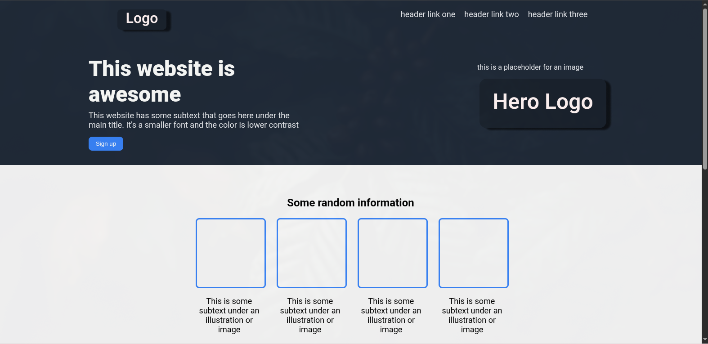

# Landing Page

This is a simple landing page project built as part of The Odin Project Foundations Course.

## Features
- Responsive layout using HTML and CSS
- Custom logo and placeholder images
- Clean, modern design

## How to Use
1. Open `index.html` in your web browser to view the landing page.
2. Explore the layout and design elements.

## Files
- `index.html` – The main HTML file for the landing page
- `style.css` – Stylesheet for the page
- `images/` – Contains logo and placeholder images
- `README.md` – This file

## Screenshots

## Credits
Built by following [The Odin Project](https://www.theodinproject.com/) curriculum.
